A Cluster Analysis of Employee Information
================
Faisal El Hussein

-   [Introduction](#introduction)
    -   [Overview](#overview)
-   [Initial Analysis](#initial-analysis)
    -   [Employee Metrics](#employee-metrics)
    -   [k-Means Clustering](#k-means-clustering)
-   [Cluster Analysis](#cluster-analysis)
-   [Conclusion](#conclusion)
-   [References](#references)

Introduction
============

Employee retention has become a prominent issue in the past several years. \[[1](https://www.linkedin.com/pulse/20130816200159-131079-employee-retention-now-a-big-issue-why-the-tide-has-turned)\] The spotlight is often put on millenials, and for good reason. A survey conducted by Deloitte in 2016 has found that 66% of millenials expect to leave their employer within five years. \[[2](https://www2.deloitte.com/content/dam/Deloitte/global/Documents/About-Deloitte/gx-millenial-survey-2016-exec-summary.pdf)\] However, employees of all ages leave for many reasons, some of which may be specific to their employer. Therefore, it may be useful to consider these cases by company!

This main objective of this analysis is to examine the [Human Resources Analytics](https://www.kaggle.com/ludobenistant/hr-analytics) simulated dataset on Kaggle and answer the following question: Why are the company's employees leaving?

The secondary objective is to conduct a thorough case of exploratory data analysis by using an intuitive approach. How? A great data analyst questions his findings and verifies the methods applied. We'll make use of our common sense and real world knowledge to make conclusions for patterns.

We'll be using R. Let's start by importing the dataset:

``` r
hr <- read.csv("HR_comma_sep.csv")
```

Overview
--------

R's `summary()` function compiles a list of descriptive statistics about the data. This is a great start because it gives us an idea of what we're working with:

``` r
summary(hr)
```

    ##  satisfaction_level last_evaluation  number_project  average_montly_hours
    ##  Min.   :0.0900     Min.   :0.3600   Min.   :2.000   Min.   : 96.0       
    ##  1st Qu.:0.4400     1st Qu.:0.5600   1st Qu.:3.000   1st Qu.:156.0       
    ##  Median :0.6400     Median :0.7200   Median :4.000   Median :200.0       
    ##  Mean   :0.6128     Mean   :0.7161   Mean   :3.803   Mean   :201.1       
    ##  3rd Qu.:0.8200     3rd Qu.:0.8700   3rd Qu.:5.000   3rd Qu.:245.0       
    ##  Max.   :1.0000     Max.   :1.0000   Max.   :7.000   Max.   :310.0       
    ##                                                                          
    ##  time_spend_company Work_accident         left       
    ##  Min.   : 2.000     Min.   :0.0000   Min.   :0.0000  
    ##  1st Qu.: 3.000     1st Qu.:0.0000   1st Qu.:0.0000  
    ##  Median : 3.000     Median :0.0000   Median :0.0000  
    ##  Mean   : 3.498     Mean   :0.1446   Mean   :0.2381  
    ##  3rd Qu.: 4.000     3rd Qu.:0.0000   3rd Qu.:0.0000  
    ##  Max.   :10.000     Max.   :1.0000   Max.   :1.0000  
    ##                                                      
    ##  promotion_last_5years         sales         salary    
    ##  Min.   :0.00000       sales      :4140   high  :1237  
    ##  1st Qu.:0.00000       technical  :2720   low   :7316  
    ##  Median :0.00000       support    :2229   medium:6446  
    ##  Mean   :0.02127       IT         :1227                
    ##  3rd Qu.:0.00000       product_mng: 902                
    ##  Max.   :1.00000       marketing  : 858                
    ##                        (Other)    :2923

This information can be used to define the attributes as follows:

-   **satisfaction\_level:** The employee's level of satisfaction with their position, on a scale from 0 to 1.
-   **last\_evaluation:** The latest evaluation of the employee's performance, on a scale from 0 to 1.
-   **number\_project:** The number of projects under an employee's belt.
-   **average\_montly\_hours:** The average number of monthly working hours.
-   **time\_spend\_company:** The number of years the employee has been with the company.
-   **Work\_accident:** Whether the employee had an accident at work; 0 for no, 1 for yes.
-   **left:** Whether the employee has left; 0 for no, 1 for yes.
-   **promotion\_last\_5years:** Whether the employee was promoted within the last five years; 0 for no, 1 for yes.
-   **sales:** Department.
-   **salary:** Salary level categorized as low, medium or high.

It's interesting to note that there are quite a few people in the sales department. The number of projects is also ambiguous; it may represent current, year-to-date or something else.

It's a good idea to find the size of the dataset, and whether there are any columns has missing values:

``` r
dim(hr)
```

    ## [1] 14999    10

``` r
any(is.na(hr))
```

    ## [1] FALSE

There are 14,999 observations and no missing values.

Initial Analysis
================

We'll import `ggplot2` for our visualizations:

``` r
library("ggplot2")
```

    ## Warning: package 'ggplot2' was built under R version 3.3.2

Employee Metrics
----------------

The workplace would be a lot less bitter if people [quit their job](https://www.youtube.com/watch?time_continue=78&v=oqtaNPOitlw) with no hard feelings. Unfortunately, employees leave simply because *someone's* not happy; either them, or their employer - think performance level. Luckily, `satisfaction_level` and `last_evaluation` capture just that. Visualizing these two attributes may reveal some patterns:

``` r
ggplot(hr) +
  geom_point(aes(x = satisfaction_level, y = last_evaluation,
                 color = factor(left)), alpha = 0.25) +
  guides(color = guide_legend(override.aes = list(alpha = 1))) +
  scale_color_manual(name = "Employee", labels = c("Stayed", "Left"),
                     values = c("#00BFC4", "#F8766D")) +
  labs(x = "Satisfaction Level", y = "Last Evaluation")
```

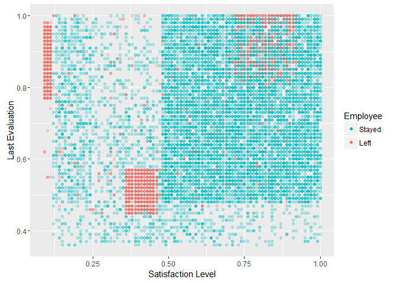

The scatter plot above shows three distinct clusters for those that left. More specifically, each cluster will give insight as to why those employees left - prompting further analysis! However, to analyze these clusters, they must be isolated from the rest of the observations.

k-Means Clustering
------------------

k-Means Clustering is a classification algorithm for partitioning observations into a set of clusters - *k* clusters, in which you define *k*. The alogrithm begins by randomly initializing *k* points, called *centroids*. Each observation is then assigned to the closest centroid, in terms of euclidean distance. Afterwards, the average of each cluster is calculated, and *that* average becomes the cluster's new centroid. The observations are reassigned to the closest centroid (remember, the old centroids were replaced by the average points), and the process repeats until the average calculated is close to the current centroid. \[[3](https://en.wikipedia.org/wiki/K-means_clustering)\]

Since the data has only two attributes, this algorithm will work well. First, we'll isolate employees who left into a separate data frame called `hr.left`:

``` r
hr.left <- hr[hr$left ==1, ]
```

And now use R's built-in `kmeans()` function, setting the number of clusters to three. We'll set a seed to make the results reproducible:

``` r
set.seed(7)
hr.clusters <- kmeans(hr.left[, c("satisfaction_level", "last_evaluation")], 3)
```

Great! Now, let's see how the algorithm performed. We'll also create a column called `cluster` in `hr.left` and add the clusters for future analysis:

``` r
hr.left$cluster <- as.numeric(hr.clusters$cluster)
```

``` r
ggplot(hr.left) +
  geom_point(aes(x = satisfaction_level, y = last_evaluation,
                 color = factor(cluster)), alpha = 0.25) +
  guides(color = guide_legend(override.aes = list(alpha = 1))) +
  scale_color_manual(name = "Cluster", values = c("#00BFC4", "#00BA38", "#F8766D")) +
  labs(x = "Satisfaction Level", y = "Last Evaluation")
```

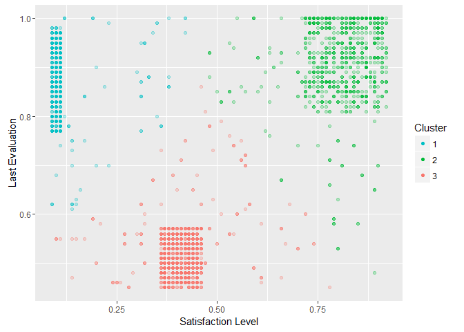

It looks like the groups were clustered correctly. However, there are quite a few outliers that may affect the analysis. This is where descriptive statistics comes to the rescure!

By calculating the distance between each observation and its respective centroid, the distribution can be plotted to check for outliers. Here are the centroids of each cluster:

``` r
hr.clusters$centers
```

    ##   satisfaction_level last_evaluation
    ## 1          0.1111547       0.8693008
    ## 2          0.8085159       0.9117093
    ## 3          0.4101455       0.5169818

Applying the calculations:

``` r
hr.left$dist.centeroid <- apply(hr.left[, c("satisfaction_level", "last_evaluation", "cluster")], 1,
                                function(obs) dist(rbind(obs[1:2], hr.clusters$centers[obs[3], ])))
```

Finally, plotting the distribution of each cluster's observations:

``` r
ggplot(hr.left) +
  geom_histogram(aes(dist.centeroid, fill = factor(cluster)), binwidth = 0.01) +
  facet_grid(. ~ cluster) +
  scale_fill_manual(values = c("#00BFC4", "#00BA38", "#F8766D"), guide = FALSE) +
  labs(x = "Distance from Centroid", y = "Count")
```

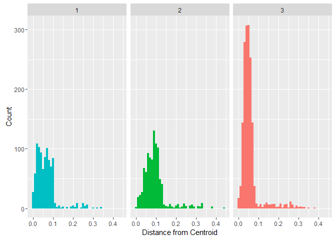

These distributions make sense when looking at the scatter plot above; the clusters have a long tail due to the outliers, and are dense near their respective median. It's common practise to label any observation outside three standard deviations from the mean as an outlier. However, due to the long tail, the standard deviation is going to be skewed. \[[4](http://www.sciencedirect.com/science/article/pii/S0022103113000668)\] Therefore, the median absolute deviation will be applied. To understand this better, here's a comparison of both deviations on the above distributions:

``` r
dev.cluster = c("1", "2", "3")
dev.sd = c(sd(hr.left$dist.centeroid[hr.left$cluster == 1]),
           sd(hr.left$dist.centeroid[hr.left$cluster == 2]),
           sd(hr.left$dist.centeroid[hr.left$cluster == 3]))
dev.mad = c(mad(hr.left$dist.centeroid[hr.left$cluster == 1]),
            mad(hr.left$dist.centeroid[hr.left$cluster == 2]),
            mad(hr.left$dist.centeroid[hr.left$cluster == 3]))
deviation = data.frame(dev.cluster, dev.sd, dev.mad)
colnames(deviation) <- c("Cluster", "SD", "MAD")
print(deviation)
```

    ##   Cluster         SD        MAD
    ## 1       1 0.05019052 0.04297842
    ## 2       2 0.05783676 0.03665484
    ## 3       3 0.04744007 0.01980715

Look up the formulae for both deviations to understand this difference. Cluster 3 especially sees a major difference in deviation.

Choosing a threshold to cut the outliers is sometimes a personal choice. We'll place it at a moderately conservative 2.5 deviations from the median. \[[4](http://www.sciencedirect.com/science/article/pii/S0022103113000668)\] Keep in mind that the distributions are not two-tailed, so the threshold will be applied only to the right-hand side:

``` r
DetectOutlier <- function(obs) {
  obs.median <- median(hr.left$dist.centeroid[hr.left$cluster == obs[1]])
  obs.mad <- mad(hr.left$dist.centeroid[hr.left$cluster == obs[1]])
  if (obs[2] < obs.median + 2.5 * obs.mad) {
    hr.left$outlier <- 0
    } else {
      hr.left$outlier <- 1
    }
  }
hr.left$outlier <- apply(hr.left[, c("cluster", "dist.centeroid")], 1, DetectOutlier)
```

Outliers will be denoted as belonging to the cluster 0:

``` r
hr.left$cluster[hr.left$outlier == 1] <- 0
```

Now, for the new clusters:

``` r
ggplot(hr.left) +
  geom_point(aes(x = satisfaction_level, y = last_evaluation, color = factor(cluster)), alpha = 0.25) +
  guides(color = guide_legend(override.aes = list(alpha = 1))) +
  scale_color_manual(name = "Cluster",
                     values = c("#AAAAAA", "#00BFC4", "#00BA38", "#F8766D")) +
  labs(x = "Satisfaction Level", y = "Last Evaluation")
```

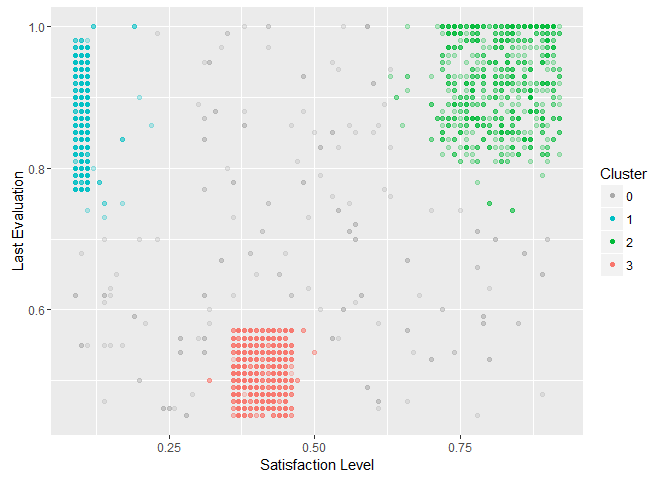

This is much better, and captures the observations that are just outside the clusters.

Cluster Analysis
================

We can now proceed to cluster analysis. When looking at the clusters, I can't help but think of departments. There are many characteristics associated with certain positions: Long hours, low salary, high salary, lax responsibilites, etc. Curiousity says to look at the department distribution:

``` r
ggplot(hr.left[hr.left$cluster != 0, ]) +
  geom_bar(aes(sales, fill = factor(cluster)), width = 0.5, position = "dodge") +
  scale_fill_manual(name = "Cluster", values = c("#00BFC4", "#00BA38", "#F8766D")) +
  theme(axis.text.x = element_text(angle=30, hjust=1)) +
  labs(x = "Department", y = "Count")
```

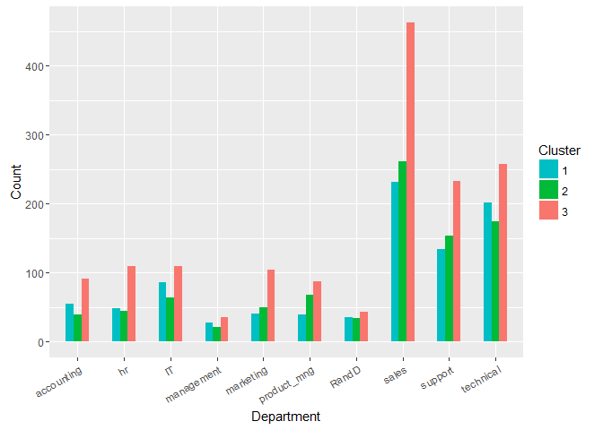

Unfortunately, it doesn't look like there are any significant patterns. Although, cluster 3 has a lot of sales people... does that indicate something? Probably not! Recall that when analyzing the summary statistics, we noticed that many employees were in sales. Additionally, in the above graph, the ratio between clusters for each department is consistent. This indicates that cluster 3 has more observations than the others:

``` r
c(table(hr.left$cluster))
```

    ##    0    1    2    3 
    ##  226  899  912 1534

We are correct. This is a great example of taking information learned beforehand and making use of it further on in the analysis.

To faciliate the following comparisons, small multiples will be used. Small multiples are a series of charts that use the same scale, but differ by one variable. \[[5](https://en.wikipedia.org/wiki/Small_multiple)\]

Another item I think about when looking at this dataset is work accidents. Could that be a reason why many employees leave?

``` r
ggplot(hr.left[hr.left$cluster != 0, ]) +
  geom_bar(aes(factor(Work_accident), fill = factor(cluster))) +
  facet_grid(. ~ cluster) +
  scale_fill_manual(values = c("#00BFC4", "#00BA38", "#F8766D"), guide = FALSE) +
  scale_x_discrete(breaks = c(0, 1), labels = c("No", "Yes")) +
  labs(x = "Work Accident", y = "Count")
```

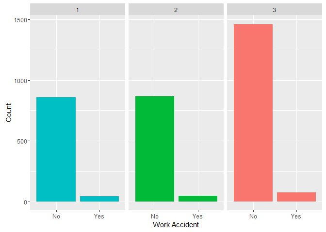

Maybe not... How about monthly hours?

``` r
ggplot(hr.left[hr.left$cluster != 0, ]) +
  geom_density(aes(average_montly_hours, fill = factor(cluster)), alpha = 0.5, color = NA) +
  scale_fill_manual(name = "Cluster", values = c("#00BFC4", "#00BA38", "#F8766D")) +
  labs(x = "Average Monthly Hours", y = "Density")
```

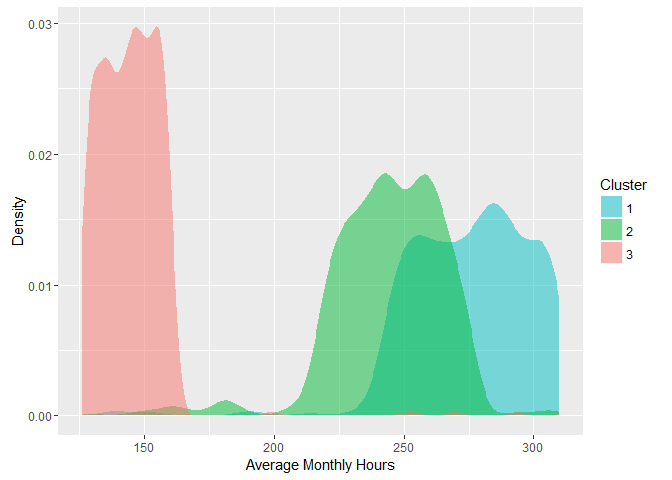

Three distinct distributions. An average work month consists of 140 - 160 hours (we don't know if the employees are based on a 35 or 40 hour work week). Cluster 3 is within the average. Cluster 1 and 2 both work many hours. It's not surprising to note that cluster 2, which had the lowest satisfaction rate, works the longest hours.

How can these hours be justified? `number_project` may provide some insight:

``` r
ggplot(hr.left[hr.left$cluster != 0, ]) +
  geom_bar(aes(number_project, fill = factor(cluster))) +
  facet_grid(. ~ cluster) +
  scale_fill_manual(values = c("#00BFC4", "#00BA38", "#F8766D"), guide = FALSE) +
  labs(x = "Number of Projects", y = "Count")
```

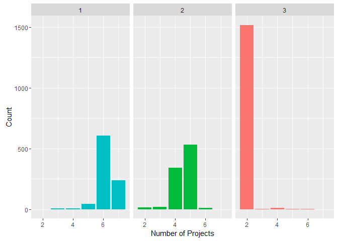

These shapes somewhat mirror the distribution in the previous chart. It looks like the high-achievers in cluster 1 are working hard on many (perhaps too many?) projects. Cluster 2 is, again, in the middle, and cluster 3 employees predominately have only two.

After looking at these charts, one would think - or hope - that employees are compensated for their efforts accordingly. Let's check the salaries of each cluster:

``` r
ggplot(hr.left[hr.left$cluster != 0, ]) +
  geom_bar(aes(salary, fill = factor(cluster))) +
  facet_grid(. ~ cluster) +
  scale_fill_manual(values = c("#00BFC4", "#00BA38", "#F8766D"), guide = FALSE) +
  labs(x = "Salary", y = "Count")
```

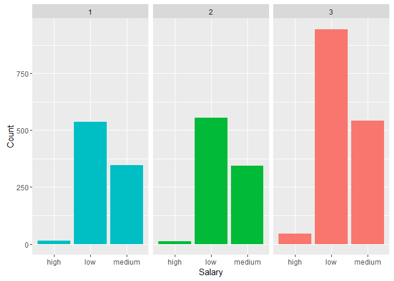

All clusters are at the same salaries. It seems, at this company, that hard work and a good evaluation doesn't equate to a higher pay. Checking the promotions may provide additional evidence:

``` r
ggplot(hr.left[hr.left$cluster != 0, ]) +
  geom_bar(aes(factor(promotion_last_5years), fill = factor(cluster))) +
  facet_grid(. ~ cluster) +
  scale_fill_manual(values = c("#00BFC4", "#00BA38", "#F8766D"), guide = FALSE) +
  scale_x_discrete(breaks = c(0, 1), labels = c("No", "Yes")) +
  labs(x = "Promotion Within the Last 5 Years", y = "Count")
```

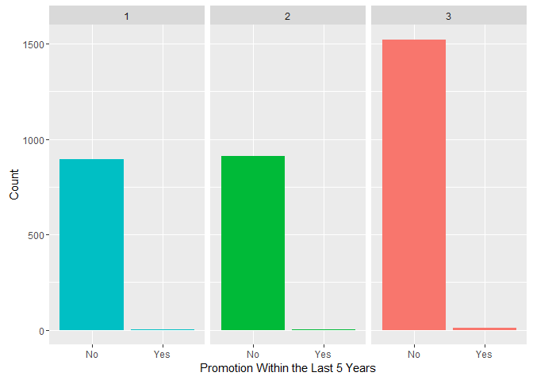

Indeed. Same salary, and no promotions. This leaves us with one final attribute: The length of each employee's stay at the company:

``` r
ggplot(hr.left[hr.left$cluster != 0, ]) +
  geom_bar(aes(time_spend_company, fill = factor(cluster))) +
  facet_grid(. ~ cluster) +
  scale_fill_manual(values = c("#00BFC4", "#00BA38", "#F8766D"), guide = FALSE) +
  labs(x = "Years with Company", y = "Count")
```

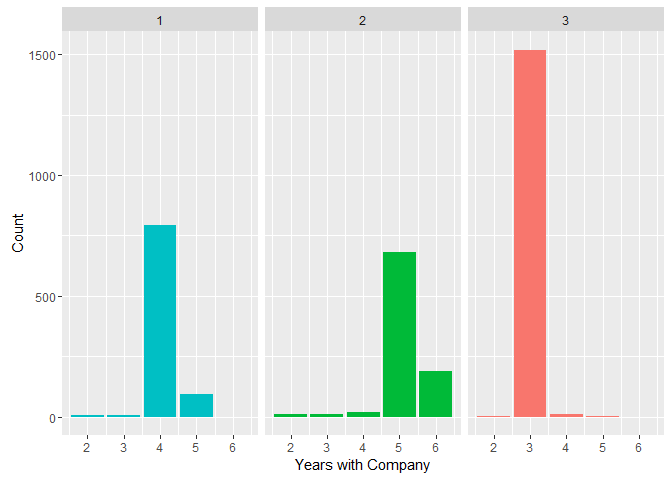

What's great is that we've gathered enough information to explain this chart. Cluster 3, who performs poorly with a low satisfaction, stays only three years. We don't know why. However, we can speculate:

-   Employees may be hired on a three-year contract.
-   Assuming the evaluations are yearly, there may a three strike policy. Employees perform poorly in the first two years, and are fired when they recieve their third poor evaluation.

Employees in cluster 1 call it quits after four years, and cluster 2 stay longer. Cluster 2, although greatly statisfied with their jobs, may have moved on to better opportunities.

Conclusion
==========

**Cluster 1:**

Employees excel in their evaluations. However, this comes at a cost. They work long hours in an attempt to juggle their projects. This effort is not being recognized by the company, as salary levels and promotion stats suggest. Most employees, perhaps frustrated, leave after four to five years.

**Cluster 2:**

Employees excel in their evaluations. They have a reasonable number of projects, and, although work long hours, are content, per their satisfaction levels. Unfortunately, after five or more years, they leave. Why? The information points to the lack of promotion and salary increase. They may have simply moved on to better opportunities.

**Cluster 3:**

This cluster is the result of poor performance combined with a low satisfaction level. These employees simply did not do a good job. They worked an average amount of hours. They were given a few projects, yet still performed poorly. They leave after only three years.

References
==========

\[1\] <https://www.linkedin.com/pulse/20130816200159-131079-employee-retention-now-a-big-issue-why-the-tide-has-turned>

\[2\] <https://www2.deloitte.com/content/dam/Deloitte/global/Documents/About-Deloitte/gx-millenial-survey-2016-exec-summary.pdf>

\[3\] <https://en.wikipedia.org/wiki/K-means_clustering>

\[4\] <http://www.sciencedirect.com/science/article/pii/S0022103113000668>

\[5\] <https://en.wikipedia.org/wiki/Small_multiple>
